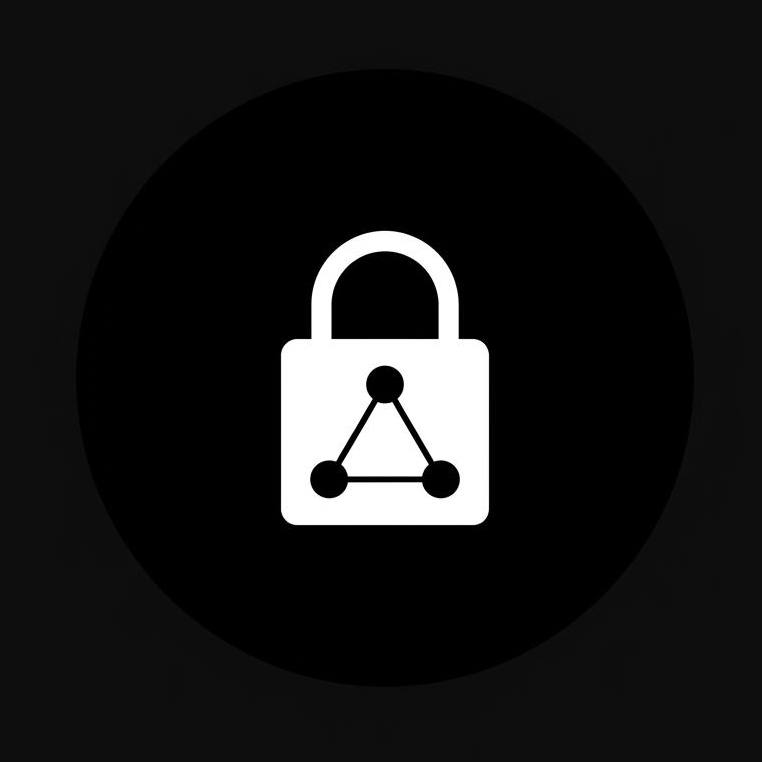
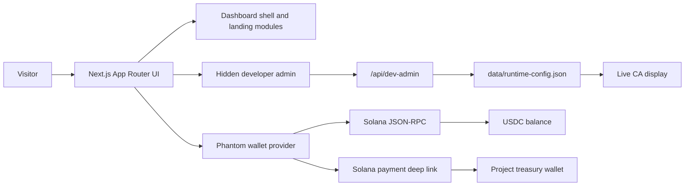
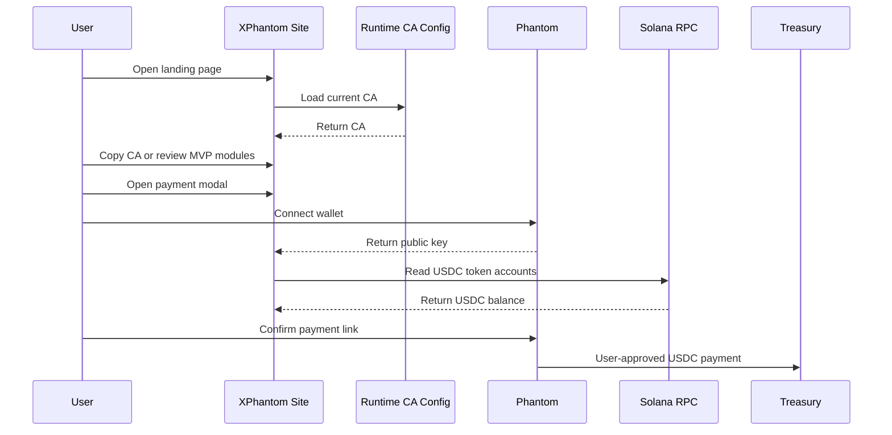

# XPhantom

<p align="center">
  <picture>
    <source srcset="./public/xphantom-logo.svg" type="image/svg+xml">
    
  </picture>
</p>

<p align="center">
  <strong>Solana token project site with Phantom wallet payments, live CA publishing, and a hidden launch admin.</strong>
</p>

<p align="center">
  <a href="https://x.com/XPhantom_s">X / Twitter</a>
  |
  <a href="https://github.com/XPhantom-max/XPhantom.git">GitHub Repository</a>
  |
  <a href="./docs/MVP_MODULES.md">MVP Modules</a>
  |
  <a href="./docs/LAUNCH_CHECKLIST.md">Launch Checklist</a>
</p>

The README logo uses an SVG source with a JPG fallback so renderers that block SVG previews can still display the brand mark.

## Overview

XPhantom is a Solana-facing token project website and launch dashboard. The project combines a polished public-facing landing experience, Phantom wallet connection, Solana USDC balance checks, payment request links, runtime CA publishing, and a hidden developer admin panel for updating launch-critical information without rebuilding the website.

The MVP is built around one first-principles user loop:

`Discover XPhantom -> Verify CA -> Connect Phantom -> Purchase USDC task -> Join the community`

The interface uses a privacy-first AI/runtime narrative to give the token project a clear product direction beyond a static token landing page.

## Project Status

| Area | Status | Notes |
| --- | --- | --- |
| Brand shell | Ready | XPhantom name, logo, responsive shell, and social links are live. |
| CA publishing | Ready | Hidden admin can update the runtime CA without redeployment. |
| Wallet connection | Ready | Phantom provider detection and wallet connection flow are implemented. |
| USDC balance | Ready | Connected wallet USDC balance is read through Solana JSON-RPC. |
| Payment flow | Ready | Preset USDC purchase tiers open a Solana payment deep link. |
| Static fallback pages | Ready | Legacy snapshot pages remain available and route key actions to live features. |
| GitHub readiness | Ready | README, env example, launch checklist, MVP docs, and git history are prepared. |
| Smart contract | Out of scope | This repository does not deploy or mint a token. |

## Core Features

- Project landing and dashboard experience for XPhantom.
- SVG README logo with JPG fallback.
- Mobile and desktop responsive interface.
- Phantom wallet detection and connection.
- Real Solana mainnet USDC balance lookup.
- Task payment modal with `30`, `50`, `100`, and `200` USDC presets.
- Solana payment deep link to the project treasury wallet.
- Hidden developer admin opened by clicking the avatar or logo 5 times.
- Password protected CA update flow.
- Runtime CA storage through `data/runtime-config.json`.
- Copyable CA display on modern pages and snapshot pages.
- X/Twitter and GitHub link placement.
- Global interaction bridge for static snapshot buttons.
- English-only repository content for public GitHub upload.

## Project Links

| Name | Value |
| --- | --- |
| X / Twitter | https://x.com/XPhantom_s |
| Official website | TBD |
| GitHub repository | https://github.com/XPhantom-max/XPhantom.git |
| Treasury wallet | `FA9se1UMmzuuUSKvEDqaBKPqCL4vexsKU6cQ1QGgSRJr` |
| Default admin password | `123456789` |
| Default Solana RPC | `https://api.mainnet-beta.solana.com` |

## Technical Architecture



## MVP User Flow



## Functional Modules

| Module | Purpose | Main Files |
| --- | --- | --- |
| Project shell | Navigation, social links, layout, and responsive dashboard frame. | `components/dashboard-shell.js`, `components/runtime-logo.js` |
| Landing page | Public project narrative, MVP section, metrics, and dashboard preview. | `components/home-page.js`, `components/mvp-modules-section.js` |
| MVP data | First-principles MVP loop and module definitions. | `lib/data/mvp.js`, `docs/MVP_MODULES.md` |
| Wallet payments | Phantom connection, balance read, payment tiers, and Solana payment link. | `components/task-payment-provider.js` |
| Developer admin | Hidden admin modal, password auth, CA validation, and runtime update. | `components/developer-admin-provider.js`, `app/api/dev-admin/route.js` |
| CA display | Copyable CA chip and fallback CA dock for snapshot pages. | `components/contract-address-chip.js` |
| Static snapshots | Legacy routes and captured pages kept available during the rebuild. | `components/snapshot-page.js`, `lib/snapshots.js`, `srcdump/` |
| Interaction bridge | Makes static snapshot buttons route to live wallet, payment, copy, and navigation actions. | `components/site-interactions-provider.js` |

## Repository Structure

```text
.
├── app/
│   ├── [[...slug]]/page.js
│   ├── api/dev-admin/route.js
│   ├── globals.css
│   ├── layout.js
│   └── providers.js
├── components/
│   ├── dashboard-shell.js
│   ├── developer-admin-provider.js
│   ├── home-page.js
│   ├── mvp-modules-section.js
│   ├── site-interactions-provider.js
│   └── task-payment-provider.js
├── docs/
│   ├── LAUNCH_CHECKLIST.md
│   └── MVP_MODULES.md
├── lib/
│   ├── data/
│   ├── server/dev-admin.js
│   ├── shared/contract-address.js
│   └── snapshots.js
├── public/
│   ├── xphantom-logo.jpg
│   └── xphantom-logo.svg
├── srcdump/
├── .env.example
├── package.json
└── README.md
```

## Tech Stack

- Next.js App Router
- React
- CSS with utility-class compatible styling
- Lucide React icons
- Phantom wallet provider
- Solana JSON-RPC
- Runtime JSON config for CA publishing

## Requirements

- Node.js 20 or newer
- npm
- Phantom wallet for wallet connection testing
- A Solana RPC endpoint for production usage

## Installation

```bash
npm install
```

## Local Development

```bash
npm run dev -- --hostname 127.0.0.1 --port 4177
```

Open:

```text
http://127.0.0.1:4177
```

## Configuration

Copy the example environment file:

```bash
cp .env.example .env.local
```

Available variables:

| Variable | Required | Default | Description |
| --- | --- | --- | --- |
| `DEV_ADMIN_PASSWORD` | No | `123456789` | Password for hidden developer admin. Change before public launch. |
| `DEV_ADMIN_SECRET` | Recommended | `zkac-hidden-dev-admin` | Secret used to derive the admin session token. Use a long random value in production. |
| `NEXT_PUBLIC_SOLANA_RPC_URL` | No | `https://api.mainnet-beta.solana.com` | Solana RPC endpoint used for USDC balance reads. |

Example:

```bash
DEV_ADMIN_PASSWORD=replace-with-a-strong-password
DEV_ADMIN_SECRET=replace-with-a-long-random-secret
NEXT_PUBLIC_SOLANA_RPC_URL=https://api.mainnet-beta.solana.com
```

## Usage

### Update The CA

1. Open the website.
2. Click the XPhantom avatar or logo 5 times quickly.
3. Enter the developer password.
4. Paste the token CA.
5. Save the value.
6. Confirm the CA chip updates on the page.

Accepted CA formats:

- EVM-style `0x` address
- 32 to 44 character base58 address

### Connect Wallet

1. Install Phantom.
2. Open the XPhantom site.
3. Click `Connect` or open the payment modal.
4. Approve the Phantom connection request.
5. Confirm the USDC balance appears in the payment modal.

### Start Payment

1. Open the payment modal.
2. Select a preset amount.
3. Click the primary payment button.
4. Confirm the request inside Phantom.

The website creates a wallet payment request. It does not transfer funds without user approval inside the wallet.

## Scripts

| Command | Purpose |
| --- | --- |
| `npm run dev` | Start the local development server. |
| `npm run build` | Create a production build. |
| `npm run start` | Start the production server after build. |

## Build

```bash
npm run build
```

## Production Deployment

1. Set production environment variables.
2. Change the default developer admin password.
3. Use a long random `DEV_ADMIN_SECRET`.
4. Verify the treasury wallet.
5. Run `npm run build`.
6. Deploy to a Next.js compatible host.
7. Open the hidden admin and publish the final CA.
8. Test desktop and mobile flows.

See `docs/LAUNCH_CHECKLIST.md` before public launch.

## Quality Checks

Before uploading to GitHub or deploying:

```bash
npm run build
git status --short
```

Optional repository language scan:

```bash
rg -n -P "[\\p{Han}\\p{Hiragana}\\p{Katakana}\\p{Hangul}]" --glob '!node_modules/**' --glob '!.next/**' --glob '!site/**' --glob '!.git/**'
```

The repository is intended to remain English-only. Communication outside the repository can be in any language.

## Project Highlights

- Runtime CA updates without redeployment.
- Wallet and payment functionality connected to the core landing page.
- Static snapshot routes are bridged into live React actions.
- README-ready SVG logo with JPG fallback.
- Clear MVP scope based on a real user loop.
- Public GitHub documentation is included.

## Roadmap

| Timeline | Stage | Scope | Status |
| --- | --- | --- | --- |
| April 2026 | MVP | Brand, CA publishing, wallet connection, payment flow, docs, launch checklist. | Complete |
| May 2026 | V1 | Admin-editable social links, payment tiers, treasury wallet, and announcement banner. | Planned |
| June 2026 | V2 | Public tokenomics page, roadmap page, and community task system. | Planned |
| July 2026 | V3 | Transaction status page, analytics, and optional backend persistence. | Planned |
| August 2026 | V4 | Optional backend persistence, richer audit logs, and production monitoring. | Planned |

## Security Notes

- This repository is not a smart contract repository.
- The website does not mint tokens.
- The website does not custody user funds.
- The website does not transfer funds without wallet confirmation.
- Always verify the treasury wallet before launch.
- Always change `DEV_ADMIN_PASSWORD` before public deployment.
- Always use a strong `DEV_ADMIN_SECRET` in production.
- Do not commit `.env.local` or `data/runtime-config.json`.

## FAQ

### Is this a token contract repository?

No. This is the public website and launch dashboard for the XPhantom Solana token project. Token minting or contract deployment must be handled separately.

### Does the payment button move funds automatically?

No. The payment flow opens a Solana wallet payment request. The user must confirm the transaction inside Phantom.

### Why is there a hidden developer admin?

The hidden admin lets the team update the token CA during launch without rebuilding or redeploying the site.

### Why does the README use both SVG and JPG logos?

Some renderers block or fail to preview SVG files. The README uses a `<picture>` block so SVG-capable renderers use the vector logo and other renderers fall back to the JPG asset.

### Where is the CA stored?

The runtime CA is stored in `data/runtime-config.json`. This file is ignored by git so local or production CA values do not get committed accidentally.

### Can the GitHub link be changed?

Yes. The current social links live in `components/dashboard-shell.js`. A future admin module can make these links runtime-editable.

## License

No license has been selected yet. Add a license before public open-source distribution if external reuse should be allowed.
